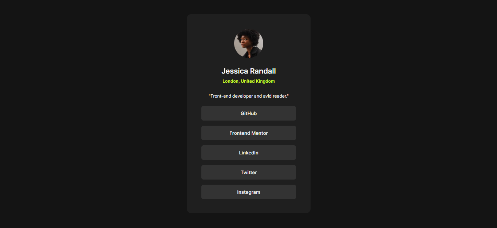

# Frontend Mentor - Social links profile solution

This is a solution to the [Social links profile challenge on Frontend Mentor](https://www.frontendmentor.io/challenges/social-links-profile-UG32l9m6dQ). Frontend Mentor challenges help you improve your coding skills by building realistic projects.

## Table of contents

- [Overview](#overview)
  - [The challenge](#the-challenge)
  - [Screenshot](#screenshot)
  - [Links](#links)
  - [Built with](#built-with)
  - [What I learned](#what-i-learned)
- [Author](#author)

### The challenge

Users should be able to:

- See hover and focus states for all interactive elements on the page

### Screenshot

### Links

- Live Site URL: [Add live site URL here](https://emmanuel-q.github.io/social-links-profile/)

### Built with

- Semantic HTML5 markup
- CSS custom properties
- Flexbox

### What I learned

I learned how to position a card in the middle of the page and also align items in the middle using flexbox.

I also learned how to make an image round using the border-radius

## Author

- Website - Emmanuel Quarshie Agblego
- Frontend Mentor - @Emmanuel-Q (https://www.frontendmentor.io/profile/@Emmanuel-Q)
